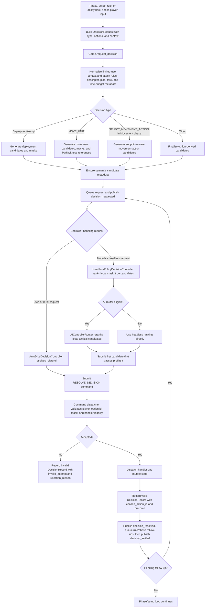
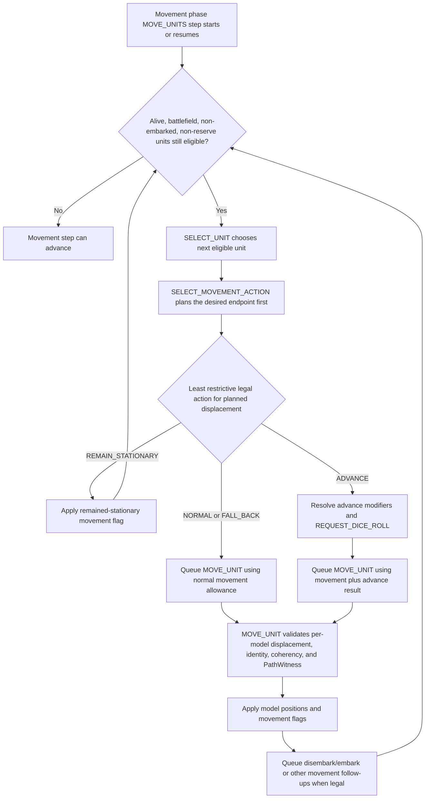

# Hierarchical AI Agent Architecture

This document defines the implemented controller-facing separation between Warhammer 40,000 AI planning layers and concrete action-selection agents.

## Runtime Contract

The authoritative engine remains the only source of legality and mutation:

1. The engine emits a `DecisionRequest`.
2. Tier 0 decorates context with rules bundle ids, descriptor ids, Tier 1 plan context, Tier 2 task context, semantic candidate metadata, masks, and time budgets.
3. `AIControllerRouter` maps the decision to exactly one policy-bundle component.
4. The selected domain component ranks only legal `mask=True` candidates and returns an `action_id`.
5. The controller submits the normal `RESOLVE_DECISION` command.
6. The engine validates, mutates state, emits events, and records `DecisionRecord` telemetry.

The router is implemented in `src/warhammer40k_ai/engine/ai_controller_router.py`.
Framework-free deterministic domain rankers live in `src/warhammer40k_ai/engine/ai_domain_agents.py`.

## Layers

| Layer | Owner | Engine Surface |
| --- | --- | --- |
| Tier 0 | Rules/legality service | candidate generation, masks, descriptor provenance, semantic metadata, `time_budget_ms` |
| Tier 1 | Strategic planner | `Tier1Plan`, scoring/denial opportunities, resource posture, risk posture, unit priority tiers |
| Tier 2 | Tactical orchestrator | `Tier2TaskBundle`, per-unit tasks, `MovementIntent`, `compute_tier`, CP reserve policy |
| Tier 2.5 | Phase coordinator | `AIControllerRouter` role selection and fallback routing |
| Tier 3 | Domain rankers | `choose_action_id(request)` over legal candidates |
| Tier 4 | Replay/training service | `DecisionRecord`, replay, relabeling, reward annotation, manifest gates |

## Policy Bundle Components

The hierarchical runtime component names are:

- `strategic_planner`
- `tactical_orchestrator`
- `deployment_ranker`
- `movement_ranker`
- `shooting_ranker`
- `charge_ranker`
- `fight_ranker`
- `tool_ranker`
- `reaction_ranker`
- `dice_policy`
- `allocation_ranker`

Each component may be backed by a heuristic resolver or learned artifact through the existing policy-bundle manifest ABI. The default heuristic registry exposes framework-free resolver ids of the form `heuristic:<component>:v1`.

## Domain Ownership

- Deployment ranker: deployment zones, reserves declaration, deployment unit order, deployment placement, Scout moves.
- Tactical orchestrator: activation order outside fight, attachments, transports, objective/terrain binding, quarry/order-style target binding.
- Movement ranker: movement action choice, normal/fall-back/advance movement, embark/disembark, floor and point choices, coherency restoration.
- Shooting ranker: ranged target/profile declarations and shooting-phase target choices.
- Charge ranker: charge declaration and charge movement.
- Fight ranker: fight target/profile/allocation choices, fight-phase activation order, pile-in and consolidate movement.
- Tool ranker: generic stratagem/tool actions and immediate optional ability choices.
- Reaction ranker: Overwatch, reactive setup/target choices, Careen-style and opponent-window reactions.
- Dice policy: engine-owned dice and reroll/substitution decisions.
- Allocation ranker: damage, Precision, target-model, hazardous, and model-selection allocation choices.
- Strategic planner: battle-round or army-wide posture choices such as doctrines, vows, blessings, rituals, secondaries, and broad resource posture.

Shared decision surfaces are context-sensitive. For example, `MOVE_UNIT` routes to deployment, charge, fight, or movement depending on `placement_kind`, `phase_step`, and `movement_type`.

## Fallback Policy

Routing is deterministic:

- If the primary component returns a masked, missing, or empty action id, the router tries configured fallbacks for the same component.
- If no component produces a legal action, the router chooses the first legal action id.
- Optional and reaction fallback paths prefer deterministic decline/skip candidates when such a candidate exists.
- Components never generate legality, mutate state, inspect UI-only objects, or submit commands directly.

## Headless Integration

`HeadlessPolicyDecisionController` accepts an optional `AIControllerRouter`. When provided, the router preselects the first candidate tried by the existing headless resolver. The resolver still uses the normal command path, payload normalization, reserves-arrival safeguards, and authoritative validation.

### Headless Decision Flow

Headless mode resolves the same `DecisionRequest` objects as UI and network play. The controller can rank candidates, but legality, mutation, follow-up decisions, and telemetry stay inside the authoritative engine path.

Movement-phase activation has an additional audit constraint: every eligible alive battlefield unit must receive a movement activation, and `SELECT_MOVEMENT_ACTION` is derived from the movement endpoint rather than chosen independently from the final `MOVE_UNIT` payload.

Audit checklist:
- Review `decision_requested` event order, then the matching `DecisionRecord` order.
- For each record, verify `request_context.phase_name`, `phase_step`, `selection_purpose`, `ability`, and limited-use metadata before interpreting the choice.
- For ranking audits, compare only legal `mask=true` candidates and confirm `chosen_action_id` appears in `candidates`.
- For movement audits, inspect `SELECT_MOVEMENT_ACTION` candidate metadata and the following `MOVE_UNIT` payload together; an `ADVANCE` label is invalid when the chosen model positions were reachable by a Normal Move unless a rule explicitly forces that state.
- If the engine changes decision ordering, update these diagrams and the affected decision/replay docs in the same change.

LLM-backed domain agents are documented in `docs/LLM_AGENT_RUNTIME.md`. They implement the same component contract and fall back to the deterministic rankers described here when the provider is unavailable or returns an illegal action id.

## Human Training Mode

`scripts/run_training_mode.py` provides one-step human imitation drills for this same component/action-id
hierarchy. The first implemented stages are `shooting_phase` (`DECLARE_SHOTS` -> `shooting_ranker`) and
`deployment_reserves` (`DECLARE_RESERVES` -> `deployment_ranker`). The Pygame training UI shows a generated
situation, asks the user to choose one legal candidate, evaluates that single decision, writes a JSONL
observation, and updates a framework-free preference model.

These observations are scoped training records rather than full-game `DecisionRecord`s. They preserve the
serialized `DecisionRequest`, candidate masks, chosen action id, component name, reward, and supervised-example
payload so later LLM or learned ranker pipelines can consume human selections without changing the authoritative
engine boundary. See `docs/TRAINING_MODE.md`.
