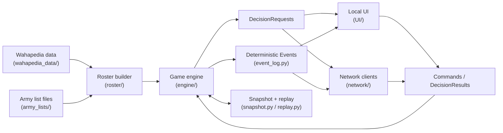

# Architecture

This repository implements a **Warhammer 40,000 (10th Edition) rules engine** with a **pygame UI**, **deterministic command/decision plumbing**, and **networked play** (server authoritative, client UI).

This document is a *high-level* map of the codebase. Detailed designs live in `docs/` (notably networking/decisions, deployment, movement, terrain, etc.).

## High-level runtime modes

- **Local interactive game**: `python3 scripts/main.py ...` runs the engine and pygame UI in one process.
- **Network play**: `python3 -m warhammer40k_ai.network.cli server|client|client-ui ...`.
- **Headless/controller-driven**: the engine can be driven purely by Commands + DecisionResults (see `docs/NETWORK_SAVELOAD_DESIGN.md`).

## Core architectural idea

### Engine-first, UI as a client

The engine is the single source of truth. The UI does not mutate core state directly.

- The engine progresses until it needs a human/agent choice.
- It emits a **DecisionRequest** (enumerated options + bounded parameters).
- A controller (UI, headless agent, or network client) responds with a **Command** / **DecisionResult**.
- The engine validates and applies it, then emits deterministic **Events**.

This pattern enables:
- deterministic replay and debugging
- save/load via snapshots + event tails
- network play (server validates commands, broadcasts events)
- future AI control without special UI-only code paths

## System overview diagram

## Major components

### Entry points

- `scripts/main.py`: main local entry point (loads armies, initializes game + UI, runs loop).
- `warhammer40k_ai.network.cli`: server/client entry points for WebSocket play.

### Game engine (`src/warhammer40k_ai/engine/`)

Purpose: **rules execution and authoritative state transitions**.

Key responsibilities:
- Game state lifecycle (`game.py`, `phase.py`, `turn_manager.py`, setup/deployment managers)
- Command validation & dispatch (`command_dispatcher.py`, `commands.py`, `command_kinds.py`)
- Decision system (`decision_requests.py`, `decisions.py`, `decision_kinds.py`, `decision_dispatcher.py`, `decision_handlers/`)
- Decision controllers & routing (`decision_controller.py`) for UI/AI/network integration
- Deterministic randomness (`random_source.py`) and dice plumbing (`dice_rolls.py`, `roll_handlers.py`)
- Persistence/replay (`snapshot.py`, `ref_codec.py`, `event_log.py`, `replay.py`, `session_store.py`)

### Rules layer (`src/warhammer40k_ai/rules/`)

Purpose: **implement faction/detachment/stratagem/enhancement abilities** and shared rule logic.

Typical responsibilities:
- provide rule “providers” / registries that the engine consults at specific timings
- translate datasheet/keyword concepts into concrete modifiers, triggers, or decisions

### Domain model

In this repository, **domain** means *the game-world concepts the engine reasons about*, independent of how they are rendered (UI) or transported (networking).

Concretely: the domain model is the set of Python types and invariants that represent **players, armies, units, models, wargear, the battlefield, and ongoing effects**.

Why it matters:
- It creates a shared vocabulary across engine/rules/UI/network.
- It is the boundary we try to keep **serializable** and **deterministic** (critical for save/load and multiplayer).

It *does* make sense to break the domain down by purpose/responsibility, because these packages are largely responsible for **state representation** (what exists) rather than **state transitions** (how the game progresses).

#### Units & combat entities (`src/warhammer40k_ai/units/`)

Purpose: represent **things that act and can be acted upon** during the game.

Responsibilities (typical):
- `Unit`: composition (models), keywords, wounds/strength state, positional state, attachment relationships.
- `Model`: per-model wounds/alive state, base/footprint, per-model wargear assignment.
- `Wargear` / weapon profiles: the equipment a model/unit can use; metadata used by rules/attack resolution.
- `Ability`: rules-facing descriptors/triggers that the rules layer can bind behavior to.
- `status_effects`: ongoing, time-bounded or conditional effects (e.g., Battle-shock) that modify the unit/model.

Non-responsibilities:
- Units should not decide *when* a phase advances or *how* a stratagem is resolved; that logic lives in the engine/rules layers.

#### Armies & player ownership (`src/warhammer40k_ai/roster/`)

Purpose: represent **who controls what** and **what was brought to the game**.

Responsibilities (typical):
- `Army`: collection of units, faction/detachment metadata, roster-wide state.
- `Player`: player identity, control role (human/agent), and per-player resources (e.g., CP, VP) as surfaced by the engine.
- Mustering scaffolding: parsing/validation hooks that turn list inputs into domain objects (see docs for current scaffolding state).

#### Battlefield & geometry (`src/warhammer40k_ai/battlefield/`)

Purpose: represent the **physical play space** the rules operate in.

Responsibilities (typical):
- Map boundaries, coordinate space, and geometry helpers.
- Terrain pieces/layouts and mission objects (objectives, deployment zones).
- Data needed to validate placements/moves/line-of-sight (often implemented with helpers in `utility/`).

#### Cross-cutting domain primitives (`src/warhammer40k_ai/utility/`)

Purpose: provide shared, reusable building blocks used by multiple subsystems.

Key responsibilities:
- **Stable identity and registries** (`entity_ids.py`, `entity_registry.py`) so references are by ID (not object pointers).
- **Deterministic ordering** utilities (`ordering.py`) to keep replay/network sync stable.
- **Modifiers, auras, and calculation helpers** (`modifiers.py`, `aura_*`, `calcs.py`).
- **Rules-adjacent mechanics utilities**: movement validation, range/distance helpers, damage allocation helpers.

Why `utility/` is included here: these are not “domain entities” themselves, but they define the *rules of representation* (IDs, ordering, fixed-point usage) that make the domain model safe for networking and persistence.

#### Domain vs engine vs rules (why this split exists)

- **Domain model**: what exists (entities + state).
- **Engine**: when/how state changes (phase flow, command validation, event emission).
- **Rules layer**: faction/detachment/keyword behavior plugged into engine timing hooks.

This separation is intentional; it reduces the risk of UI- or network-driven side effects and keeps save/load + replay feasible.

### UI (`src/warhammer40k_ai/UI/`)

Purpose: **presentation + user input**.

Responsibilities:
- render the battlefield and unit panels
- show dialogs that correspond to engine DecisionRequests
- convert user choices into deterministic Commands

See also: `docs/DIALOG_MANAGER.md` and dialog mapping in `docs/NETWORK_SAVELOAD_DESIGN.md`.

### Networking (`src/warhammer40k_ai/network/`)

Purpose: **server-authoritative multiplayer over WebSockets**.

Responsibilities:
- protocol/message types (`protocol.py`, `messages.py`)
- server/client orchestration (`server.py`, `client.py`, `transport.py`, `lobby.py`, `game_session.py`)
- preserve determinism by sending Commands to server and broadcasting Events to clients

### Data ingestion (`src/warhammer40k_ai/waha_helper/` + `wahapedia_data/`)

Purpose: **load structured game data** (datasheets, wargear, keywords, etc.) into usable representations.

- `wahapedia_data/` is the canonical structured data source in-repo.
- `scripts/get_wahapedia_data.py` updates/refetches that dataset.

### Tests (`tests/`)

Purpose: **validate rules behavior and regression safety** (pytest).

The codebase has extensive focused tests for rules interactions, timing, and decision flows.

## General data flow

1. **Load data**: wahapedia-derived JSON/CSV is read via helper tooling.
2. **Build rosters**: army lists are parsed into `Army`/`Unit`/`Model`/`Wargear` objects.
3. **Initialize game**: engine constructs the battlefield, mission/deployment state, registries/IDs.
4. **Run engine loop**:
   - engine advances phases/steps
   - emits Events as state changes occur
   - pauses on DecisionRequests when a player choice is required
5. **Controller responds**:
   - local UI or network client selects an option
   - submits a Command/DecisionResult
6. **Apply + broadcast**:
   - engine validates, applies, logs Events
   - UI renders from state and/or event stream; network server broadcasts Events
7. **Persistence (optional)**: snapshots + event tails support save/load and resync.

## Development principles (guidelines for new modules)

- **Determinism first**: stable IDs, stable ordering, single RNG source; prefer event log + replay.
- **Explicit decisions**: any optional/choice-based rule becomes a DecisionRequest (no hidden UI shortcuts).
- **Separation of concerns**:
  - engine must not depend on UI
  - UI is a client of the command/decision API
  - networking transports commands/events; does not re-implement rules
- **Latest-only rules**: implement against current official rules/errata/dataslates; do not add compatibility shims.
- **Small, composable modules**: avoid duplicating logic; extract shared utilities.
- **Tests + docs for behavior changes**: rule/engine behavior changes should come with pytest coverage and a `docs/` update.

## Related design docs

- `docs/NETWORK_SAVELOAD_DESIGN.md`: decision/command/event model, determinism rules, dialog mapping.
- `docs/DEPLOYMENT_ARCHITECTURE.md`, `docs/MOVEMENT_SYSTEM.md`, `docs/RUINS_TERRAIN_SYSTEM.md`: deeper subsystem designs.
