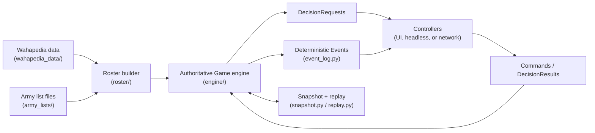
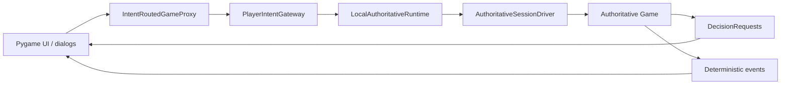
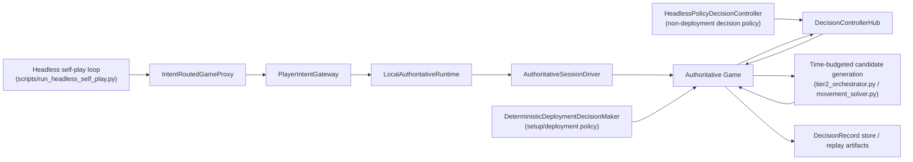
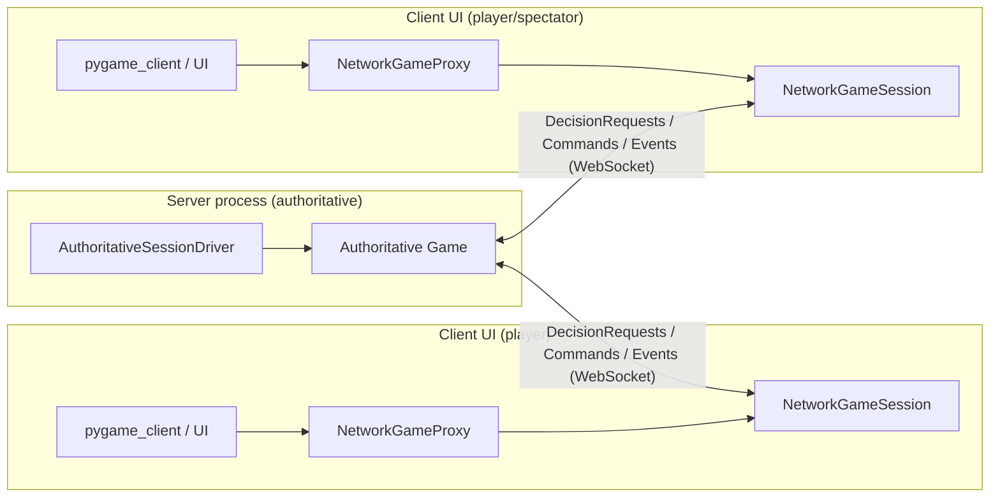
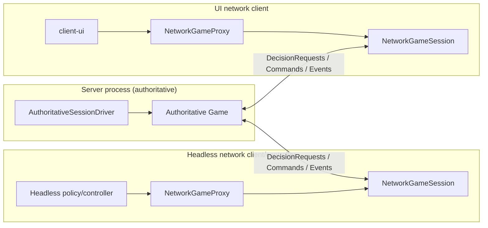

# Architecture

This repository implements a **Warhammer 40,000 rules engine** with a **pygame UI**, **deterministic command/decision plumbing**, and **networked play** (server authoritative, client UI).

This document is a *high-level* map of the codebase. Detailed designs live in `docs/` (notably networking/decisions, deployment, movement, terrain, etc.).

## 11th edition port scaffolding

The codebase is now carrying explicit landing zones for the 11th-edition port-prep
work. PR-001 is structural only: it adds scaffolding, test-layout guardrails, and
focused destination modules while keeping current gameplay behavior intact.

Review expectations and PR status for this work are documented in
`docs/implementation/11e_port_pr_plan.md`.

## High-level runtime modes

- **Local interactive game**: `uv run python scripts/main.py ...` runs the engine and pygame UI in one process.
  - Local composition uses `engine/local_runtime.py` (`LocalAuthoritativeRuntime`) for shared authoritative setup orchestration without websocket loopback.
  - Add `--profile` to write launch-time cProfile and section-timer artifacts for UI runs.
- **Network play**: `python3 -m warhammer40k_ai.network.cli server|client|client-ui|client-headless ...`.
- **Headless/controller-driven**: the engine can be driven purely by Commands + DecisionResults (see `docs/NETWORK_SAVELOAD_DESIGN.md`).
  - Local self-play (`scripts/run_headless_self_play.py`) now reuses the same local authoritative runtime shell (`LocalAuthoritativeRuntime` + `AuthoritativeSessionDriver`) as interactive local play.
  - Headless local setup/deployment is split by ownership: `DeterministicDeploymentDecisionMaker` answers deployment-manager-owned setup choices, while `HeadlessPolicyDecisionController` answers the remaining masked `DecisionRequest`s.
  - `MOVE_UNIT` is the shared movement decision surface for deployment placement, reserves arrival, battle movement, charge movement, and fight-phase pile-in/consolidate. UI and headless differ in who chooses the payload, not in the authoritative validation path.
  - Self-play exports authoritative `DecisionRecord`s from the live game store and can bound long-running games with `--max-phase-steps` plus per-decision reserve-arrival search limits.
  - Add `--profile` to write per-worker/per-game profiling artifacts for movement, deployment, and line-of-sight hotspot analysis. Details live in `docs/PROFILING.md`.

## Core architectural idea

### Engine-first, UI as a client

The engine is the single source of truth. The UI does not mutate core state directly.

- The engine progresses until it needs a human/agent choice.
- It emits a **DecisionRequest** (enumerated options + bounded parameters).
- A controller (UI, headless agent, or network client) responds with a **Command** / **DecisionResult**.
- The engine validates and applies it, then emits deterministic **Events**.
- `Game.map` is assigned through the `Game.map` property or `Game.set_map(...)`; both restore the
  `map.game` back-reference used by terrain, network snapshots, and local script initialization.
- Human/AI choice callbacks are installed on `Game.decision_port`; `Map` rejects provider attributes and
  does not own UI/interaction hooks.
- Faction-level rule routing uses `rules/faction_registry.py` for canonical faction ids, aliases, names,
  and primary keywords before detachment/rule-provider lookup.

This pattern enables:
- deterministic replay and debugging
- save/load via snapshots + event tails
- network play (server validates commands, broadcasts events)
- future AI control without special UI-only code paths

## System overview diagrams

### 1) Common authoritative pipeline (all modes)

### 2) Local + non-headless (interactive pygame)

Use case:
- Human vs Human on one machine (`scripts/main.py` default local interactive path).

### 3) Local + headless (no UI)

Use case:
- AI vs AI self-play (`scripts/run_headless_self_play.py`).

Current headless flow:
- `scripts/run_headless_self_play.py` drives setup and phase progression through the same authoritative runtime/driver shell as local interactive play, then drains pending decisions until the game ends or the configured phase-step cap is reached.
- Driver-managed mission selection stays in `AuthoritativeSessionDriver`; the generic `HeadlessPolicyDecisionController` skips `CHOOSE_MISSION` rather than trying to resolve setup-owned mission/layout requests itself.
- Deployment is not a special UI-only path in headless mode. Zone selection, reserve declarations, next-unit selection, and placement are resolved by `DeterministicDeploymentDecisionMaker`, optionally with a deployment ranking model.
- Other non-deployment choices go through `HeadlessPolicyDecisionController`, which ranks only legal masked candidates, synthesizes deterministic `DECLARE_SHOTS` payloads when the request exposes only a coarse Confirm/Skip choice, allows Hazardous profiles, chooses one profile per multi-profile ranged weapon by best hit-probability x wound-probability against legal targets, prevalidates `MOVE_UNIT` payloads before auto-submission, and tries bounded reserves-arrival brute force before any deterministic skip when no legal placement candidate survives masking.
- Time-budgeted solvers feed candidate metadata into `DecisionRecord`s, so headless runs capture candidates, masks, chosen actions, wall-clock timing, and fallback mode for replay/training use.
- Headless deployment reuses generated placement payloads during validation so candidate generation does not run the same formation search twice for one anchor.
- Hierarchical AI routing is available through `AIControllerRouter`: it maps each emitted `DecisionRequest` to a policy-bundle component such as `movement_ranker`, `shooting_ranker`, `fight_ranker`, or `dice_policy`. The router only orders already-legal candidates and hands them back to the existing command-resolution path.
- Line-of-sight visibility contexts and legacy shooting-mixin LOS checks are cached by model positions, unit visibility flags, blocker positions, hidden/preview state, and terrain signatures. These caches are diagnostic/performance-only and do not change DecisionRecord or replay semantics.
- Fight-phase pile-in and consolidate now continue through the same authoritative `MOVE_UNIT` pipeline as other movement decisions, with shared planning/validation instead of legacy UI-only movement hooks.

### 4) Remote + non-headless (server authoritative, UI clients)

Use case:
- Human vs Human over network (two `client-ui` players).

### 5) Remote + headless controller(s)

Use cases:
- AI vs Human (one UI client, one headless controller/client).
- AI vs AI (two headless controllers/clients).

Current entrypoint:
- `python3 -m warhammer40k_ai.network.cli client-headless --role player1|player2 ...`
  - Builds `NetworkGameSession`, waits for authoritative snapshot/resync, then attaches `HeadlessPolicyDecisionController` to the local `NetworkGameProxy`.

Notes:
- In network mode, default auto-resolution is dice-only unless a full policy controller is explicitly attached.
- Server remains authoritative in all remote combinations.

### Matchup matrix (who controls each side)

| Matchup | Local non-headless | Local headless | Remote non-headless | Remote headless/hybrid |
|---|---|---|---|---|
| Human vs Human | Yes (`scripts/main.py`) | No | Yes (`server` + 2x `client-ui`) | N/A |
| AI vs AI | Possible via custom local composition, but primary path is headless | Yes (`scripts/run_headless_self_play.py`) | Possible with 2 headless controllers/clients | Yes |
| AI vs Human | Possible via custom mixed controller composition | Yes (mixed controller composition) | Yes (1x `client-ui`, 1x headless controller/client) | Yes |

Explicit controller ownership:
- Human vs Human: both sides answer decision requests via UI dialogs.
- AI vs Human: one side answers via headless policy/controller, the other via UI.
- AI vs AI: both sides answer via headless policy/controller (local self-play or remote clients).

## Major components

### Entry points

- `scripts/main.py`: main local entry point (loads armies, initializes game + UI, runs loop).
- `scripts/run_headless_self_play.py`: local AI-vs-AI self-play entry point for deterministic headless runs and `DecisionRecord` export.
- `warhammer40k_ai.network.cli`: server/client entry points for WebSocket play.

### Game engine (`src/warhammer40k_ai/engine/`)

Purpose: **rules execution and authoritative state transitions**.

Key responsibilities:
- Game state lifecycle (`game.py` facade, explicit `game_*` services, legacy `game_mixins/`, `phase.py`, `turn_manager.py`, setup/deployment managers)
- Command validation & dispatch (`command_dispatcher.py`, `commands.py`, `command_kinds.py`)
- Shared authoritative orchestration (`authoritative_session_driver.py`) and channel adapters (`command_channel.py`)
- Local authoritative runtime composition (`local_runtime.py`)
- Decision system (`decision_requests.py`, `decisions.py`, `decision_kinds.py`, `decision_dispatcher.py`, `decision_handlers/`)
- Decision controllers & routing (`decision_controller.py`) for UI/AI/network integration
- Runtime provider hooks are owned by `Game.decision_port`; `Map` rejects
  provider attributes so missing UI/AI/network wiring fails immediately instead
  of silently falling back to battlefield state.
- Headless setup/deployment and policy control (`deployment_headless.py`, `headless_policy_controller.py`)
- Time-budgeted candidate generation and telemetry (`time_manager.py`, `tier2_orchestrator.py`, `movement_solver.py`, `decision_record.py`)
- Hierarchical AI routing and framework-free domain rankers (`ai_controller_router.py`, `ai_domain_agents.py`)
- Shared movement/fight planning and authoritative movement validation (`movement_intent.py`, `fight_move.py`, `decision_handlers/movement.py`)
- Edition-aware combat invariants, rules/geometry profiles, and decomposed combat orchestration (`combat_timing.py`, `stratagem_ledger.py`, `attack_sequence.py`, `attack_reporting.py`, `fight_order.py`, `fight_engagement.py`, `fight_resolution.py`)
- Deterministic randomness (`random_source.py`) and dice plumbing (`dice_rolls.py`, `roll_handlers.py`)
- Persistence/replay (`snapshot.py`, `ref_codec.py`, `event_log.py`, `replay.py`, `replay_store.py`, `session_store.py`)
  - Snapshot/ref encoding preserves stable object references, including `WargearProfile` values via parent-wargear/profile-name reconstruction during load/resync.

`Game` composition notes:
- `game.py` is a thin facade for constructor/state wiring, service composition, ruleset/map helpers, and stable method-name compatibility.
- Explicit facade services own lifecycle domains: charge, fight eligibility, command dispatch, scoring/actions, setup/deployment/reserves, phase handlers, reactive decisions, shooting/heavy fight handlers, direct rule-event callbacks, and faction transient runtime storage.
- `game_mixins/` remains as legacy implementation bases for service classes and focused tests, but `Game` no longer inherits those mixins.
- Rule-provider subscriptions can resolve dotted service handlers such as `rule_events._on_unit_destroyed_rules` while bare legacy handler names remain compatible through the facade.
- This split keeps `from warhammer40k_ai.engine.game import Game` stable while enforcing the facade line-budget guardrail.

### Rules layer (`src/warhammer40k_ai/rules/`)

Purpose: **implement faction/detachment/stratagem/enhancement abilities** and shared rule logic.

Typical responsibilities:
- provide rule “providers” / registries that the engine consults at specific timings
- translate datasheet/keyword concepts into concrete modifiers, triggers, or decisions
- parse strict rules text patterns (e.g., attack roll modifiers including isolated-target checks: no other enemy units within X" of the target)

### Domain model

In this repository, **domain** means *the game-world concepts the engine reasons about*, independent of how they are rendered (UI) or transported (networking).

Concretely: the domain model is the set of Python types and invariants that represent **players, armies, units, models, wargear, the battlefield, and ongoing effects**.

Why it matters:
- It creates a shared vocabulary across engine/rules/UI/network.
- It is the boundary we try to keep **serializable** and **deterministic** (critical for save/load and multiplayer).

It *does* make sense to break the domain down by purpose/responsibility, because these packages are largely responsible for **state representation** (what exists) rather than **state transitions** (how the game progresses).

#### Units & combat entities (`src/warhammer40k_ai/units/`)

Purpose: represent **things that act and can be acted upon** during the game.

Responsibilities (typical):
- `Unit`: composition (models), keywords, wounds/strength state, positional state, attachment relationships.
  - `unit.py` stays the stable facade, with extracted combat-runtime helpers in `units/unit_mixins/combat_runtime_mixin.py`.
  - `units/unit_mixins/positioning_mixin.py` is now also a facade over focused positioning/runtime submixins for lifecycle, enhancement/bodyguard checks, attack bonus resolution, fight movement, and deployment traits.
- `Model`: per-model wounds/alive state, base/footprint, per-model wargear assignment.
- `Wargear` / weapon profiles: the equipment a model/unit can use; metadata used by rules/attack resolution.
- `Ability`: rules-facing descriptors/triggers that the rules layer can bind behavior to.
- `status_effects`: ongoing, time-bounded or conditional effects (e.g., Battle-shock) that modify the unit/model.

Non-responsibilities:
- Units should not decide *when* a phase advances or *how* a stratagem is resolved; that logic lives in the engine/rules layers.

#### Armies & player ownership (`src/warhammer40k_ai/roster/`)

Purpose: represent **who controls what** and **what was brought to the game**.

Responsibilities (typical):
- `Army`: collection of units, faction/detachment metadata, roster-wide state.
- `Player`: player identity, control role (human/agent), and per-player resources (e.g., CP, VP) as surfaced by the engine.
- Mustering scaffolding: parsing/validation hooks that turn list inputs into domain objects (see docs for current scaffolding state).

#### Battlefield & geometry (`src/warhammer40k_ai/battlefield/`)

Purpose: represent the **physical play space** the rules operate in.

Responsibilities (typical):
- Map boundaries, coordinate space, and geometry helpers.
- Terrain pieces/layouts and mission objects (objectives, deployment zones).
- Data needed to validate placements/moves/line-of-sight (often implemented with helpers in `utility/`).

#### Cross-cutting domain primitives (`src/warhammer40k_ai/utility/`)

Purpose: provide shared, reusable building blocks used by multiple subsystems.

Key responsibilities:
- **Stable identity and registries** (`entity_ids.py`, `entity_registry.py`) so references are by ID (not object pointers).
- **Deterministic ordering** utilities (`ordering.py`) to keep replay/network sync stable.
- **Modifiers, auras, and calculation helpers** (`modifiers.py`, `aura_*`, `calcs.py`).
- **Rules-adjacent mechanics utilities**: range/distance helpers and damage allocation helpers.

Movement/path validation is owned by `src/warhammer40k_ai/pathing/validation.py`,
not by `utility.calcs`, so pathing entrypoints fail fast when required map context
is missing and do not route through legacy utility validation.
State-transfer helpers also fail explicitly: unit splitting raises `UnitSplitError`
when cloning, detaching, map/army insertion, registry rebuild, or subscriber refresh
cannot complete, and Hazardous helper utilities raise `TypeError`/`ValueError` for
malformed profile, wargear, model, or roll inputs.

Why `utility/` is included here: these are not “domain entities” themselves, but they define the *rules of representation* (IDs, ordering, fixed-point usage) that make the domain model safe for networking and persistence.

#### Domain vs engine vs rules (why this split exists)

- **Domain model**: what exists (entities + state).
- **Engine**: when/how state changes (phase flow, command validation, event emission).
- **Rules layer**: faction/detachment/keyword behavior plugged into engine timing hooks.

This separation is intentional; it reduces the risk of UI- or network-driven side effects and keeps save/load + replay feasible.

### UI (`src/warhammer40k_ai/UI/`)

Purpose: **presentation + user input**.

Responsibilities:
- render the battlefield and unit panels
- show dialogs that correspond to engine DecisionRequests
- convert user choices into deterministic Commands
- UI must not originate decision requests. UI modules consume already-issued pending requests via engine bridge readers (`require_pending_decision_request(...)`) and only submit deterministic decision commands/results.
- `engine/ui_decision_bridge.py` is intentionally reader-only for UI call sites (no UI-facing request construction/enqueue helpers).
- Mission selection request issuance is engine-authoritative: when setup advances into `SELECT_MISSION_OBJECTIVES`, the engine queues `CHOOSE_MISSION` and UI only consumes that pending request.
- Fight-phase target selection, melee weapon declaration, and melee target allocation follow the same authoritative request path in UI and headless modes; UI dialogs only override pending request payloads, they do not run a separate local fight sequencer. Melee attack resolution requires `DECLARE_MELEE_WEAPONS` declarations; deterministic default declarations may be exposed as request payload data, but are not applied implicitly by resolution code.
- project authoritative game updates through shared UI/HUD orchestration (`session_presentation_orchestrator.py`)
- rebuild HUD state from authoritative presentation transcripts (`presentation_state_hydrator.py`)
- avoid importing GUI backends at package import time; entry points should import GUI modules lazily so headless tooling/tests remain stable

See also: `docs/DIALOG_MANAGER.md` and dialog mapping in `docs/NETWORK_SAVELOAD_DESIGN.md`.

### Networking (`src/warhammer40k_ai/network/`)

Purpose: **server-authoritative multiplayer over WebSockets**.

Responsibilities:
- protocol/message types (`protocol.py`, `messages.py`)
- server/client orchestration (`server.py`, `client.py`, `transport.py`, `lobby.py`, `game_session.py`)
- preserve determinism by sending Commands to server and broadcasting Events to clients

### Data ingestion (`src/warhammer40k_ai/waha_helper/` + `wahapedia_data/`)

Purpose: **load structured game data** (datasheets, wargear, keywords, etc.) into usable representations.

- `wahapedia_data/` is the canonical structured data source in-repo.
- `scripts/get_wahapedia_data.py` updates/refetches that dataset.
- Wahapedia CSV-to-JSON conversion normalizes unstable punctuation and spacing at ingestion
  (curly quotes/apostrophes, dash variants, non-breaking/thin spaces, zero-width characters,
  and known mojibake forms). `WahaHelper.clean_data()` applies the same normalization at
  runtime for generated or intermediate text, and matching code should use canonical text keys
  for user-authored/imported army-list names.
- `WahaHelper` raises `WahaDataError` for a missing data directory, missing mandatory JSON
  files, invalid JSON, malformed rows, and enhancement parsing failures. Data snapshots are
  cached only after a complete successful load.

### Tests (`tests/`)

Purpose: **validate rules behavior and regression safety** (pytest).

The codebase has extensive focused tests for rules interactions, timing, and decision flows.

## General data flow

1. **Load data**: wahapedia-derived JSON/CSV is read via helper tooling.
2. **Build rosters**: army lists are parsed into `Army`/`Unit`/`Model`/`Wargear` objects.
3. **Initialize game**: engine constructs the battlefield, mission/deployment state, registries/IDs.
4. **Run engine loop**:
   - engine advances phases/steps
   - emits Events as state changes occur
   - pauses on DecisionRequests when a player choice is required
5. **Controller responds**:
   - local UI or network client selects an option
   - submits a Command/DecisionResult
6. **Apply + broadcast**:
   - engine validates, applies, logs Events
   - UI renders from state and/or event stream; network server broadcasts Events
7. **Persistence (optional)**: snapshots + event tails support save/load and resync.

## Development principles (guidelines for new modules)

- **Determinism first**: stable IDs, stable ordering, single RNG source; prefer event log + replay.
- **Explicit decisions**: any optional/choice-based rule becomes a DecisionRequest (no hidden UI shortcuts).
- **Separation of concerns**:
  - engine must not depend on UI
  - UI is a client of the command/decision API
  - networking transports commands/events; does not re-implement rules
- **Latest-only rules**: implement against current official rules/errata/dataslates; do not add compatibility shims.
- **Small, composable modules**: avoid duplicating logic; extract shared utilities.
- **Tests + docs for behavior changes**: rule/engine behavior changes should come with pytest coverage and a `docs/` update.

## Related design docs

- `docs/NETWORK_SAVELOAD_DESIGN.md`: decision/command/event model, determinism rules, dialog mapping.
- `docs/DEPLOYMENT_ARCHITECTURE.md`, `docs/MOVEMENT_SYSTEM.md`, `docs/RUINS_TERRAIN_SYSTEM.md`: deeper subsystem designs.
- `docs/MODEL_GEOMETRY_OVERRIDES.md`: model footprint/height/z-offset resolution, including compound fortification geometry.
